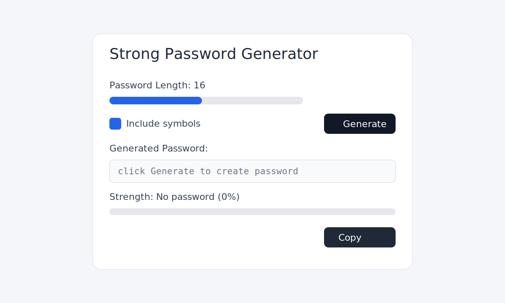

# Strong Password Generator (Python + EXE)

Simple desktop password generator with a clean UI.

## Features

- Password length slider (8 to 64)
- Optional symbols toggle
- Live password strength meter
- One-click copy to clipboard

## Screenshots

### Home



### Generated Password Example


## Run with `py`

```bat
py password_generator.py
```

## Build EXE with `py`

1. Install PyInstaller:

```bat
py -m pip install pyinstaller
```

2. Build executable:

```bat
py -m PyInstaller --onefile --windowed --name PasswordGenerator password_generator.py
```

3. Find your EXE at:

- `dist\\PasswordGenerator.exe`

## Notes

- Every time you click **Generate**, a new strong password is created.
- Uses Python `secrets` module for cryptographically secure randomness.
- Keep the executable in: `dist\\PasswordGenerator.exe`
